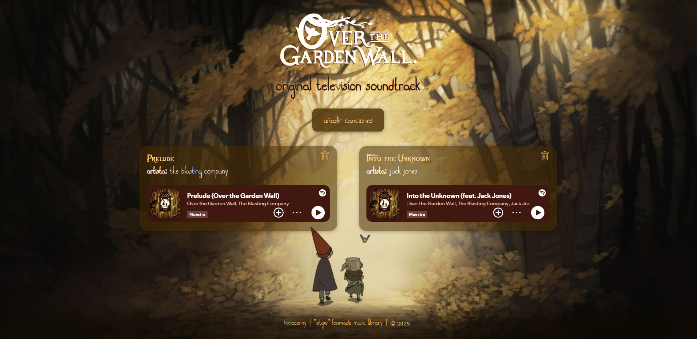

# 🌲 Over the Garden Wall | Fanmade Music Library  

> Biblioteca musical interactiva basada en la banda sonora de la serie *Over the Garden Wall*.  
> Proyecto de práctica web con integración de Spotify y gestión de canciones en LocalStorage.


---

## 🔗 Enlaces

- **Despliegue del proyecto:** [🔗 https://otgw-musiclibrary-nu.vercel.app/l](#)  
- **Backend (API en Koyeb):** [🔗 https://otgw-server-littlecorny.koyeb.app/](#)  

---

# Estructura

otgw-front/
│
├── assets/                 # Recursos (imágenes, fuentes, iconos, audio)
├── index.html              # Página principal
├── styles.css              # Estilos
├── script-formulario.js    # Creación del formulario y las notificaciones
└── script.js               # Renderizado de las canciones y creación de tarjetas

---

## 🧭 Descripción Funcional  

**Over the Garden Wall | Fanmade Music Library** es una aplicación web que permite:  
- Visualizar y reproducir canciones desde un backend (API propia).  
- Integrar widgets de **Spotify** o reproducir archivos `.mp3` locales.  
- Añadir y eliminar canciones manualmente al almacenamiento local.  

El enfoque principal es mostrar una interfaz bonita, limpia e interactiva, optimizada para ser intuitiva y sencilla.

---

## 🧩 Arquitectura y Stack  

| Capa |  Tecnologías | Descripción |
|------|--------------|-------------|
| **Frontend** | HTML5, CSS3, JavaScript | Interfaz, renderizado de tarjetas y control del reproductor. |
| **Backend (API)** | Node.js + Express  | Provee el listado de canciones |
| **Hosting** | Vercel (Front) + Koyeb (Back) | Despliegue del servidor |

---

## ⚙️ Guía de Instalación y Ejecución  

1. Clona el repositorio del frontend:  
   ```bash
   git clone https://github.com/littlecorny/otgw-front
   cd otgw-front

2. Abre el archivo principal `index.html` y ejecútala con LiveServer

3. Si lo ejecutas localmente, asegúrate de actualizar la URL del backend en script.js:

    const API_URL = "https://otgw-server-littlecorny.koyeb.app";

4. ¡Listo!


---


# 🛠️ Conceptos Técnicos Aplicados

- Consumo de API REST mediante fetch() con asincronía y async/await.

- Render dinámico del DOM (creación de tarjetas y reproductores desde JS).

- Gestión de estado local con localStorage para persistencia sin base de datos.

- Integración de iframes de Spotify, controlando tiempos de carga para evitar bloqueos.

- Optimización visual responsiva sin frameworks externos.


# 🧠 Reflexión y Aprendizaje

Este proyecto nació como una práctica de CRUD y servidores para clase, de la cual he aprendido a:

- Conectar el front y el end y leer los datos del CRUD. 

- Gestionar asincronía y evitar bloqueos de la app.

- Diseñar una interfaz funcional, estética y accesible.

También fue mi primera oportunidad para aprender a publicar mis proyectos por separado en páginas como Vercel y Koyeb, conectándolos entre sí y entendiendo las necesidades de una aplicación online.

---

📬 Contacto

📧 littlecorny | https://github.com/littlecorny
🌐 https://carlapajuelopaniag.wixsite.com/portfolio

Proyecto creado con fines educativos y de portfolio.
